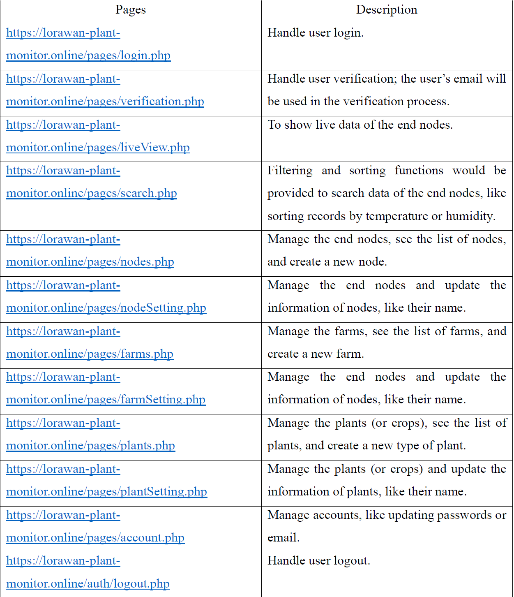

# 🌿 LoRaWAN Plant Monitoring System

> An End-to-End IoT solution designed for agricultural monitoring, leveraging LoRaWAN architecture for secure data transmission and a PHP-based web dashboard for centralized management.

**🎥 [Watch Project Demo](https://youtu.be/oPejHBNpKV4)** | **📊 [View Presentation Slides](https://1drv.ms/b/s!AgluXs-pQk8WrPN7x25PJYITs-jF5A?e=zXE1T8)**

## 🛠️ Tech Stack
* **Hardware & Network:** Arduino, LoRa End Nodes, The Things Stack (TTS), LoRaWAN Protocol
* **Security:** AES Encryption, Secure Email Verification
* **Web Backend & DB:** PHP, MySQL
* **Frontend:** HTML/CSS, JavaScript, Bootstrap

## ✨ Core Features

### 🔐 Security & Access Control
* **Authentication:** Secure user login, account management, and email-based verification workflows.

### 📊 Data Visualization & Processing
* **Live Dashboard:** Real-time monitoring and visualization of telemetry data from remote end nodes.
* **Data Filtering:** Advanced sorting and searching capabilities (e.g., filtering records by temperature, humidity).

### ⚙️ System Management (CRUD)
* **Node Management:** Register, update, and manage LoRa end nodes dynamically.
* **Farm & Crop Configuration:** Centralized control panel to define and manage farm locations and specific plant/crop types.

